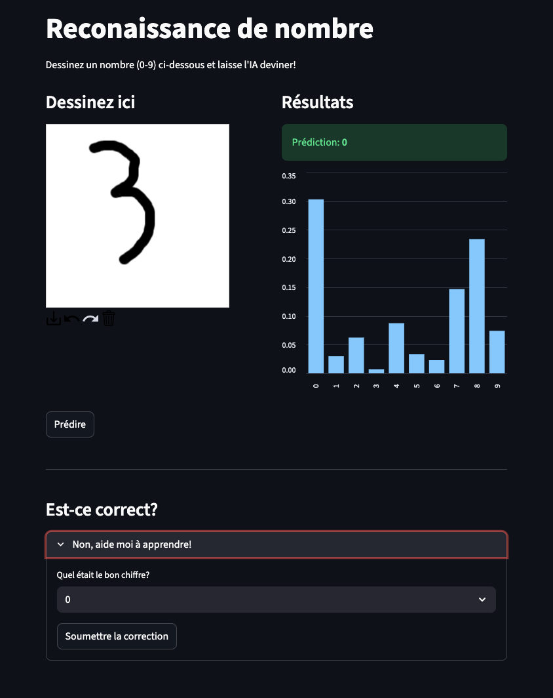
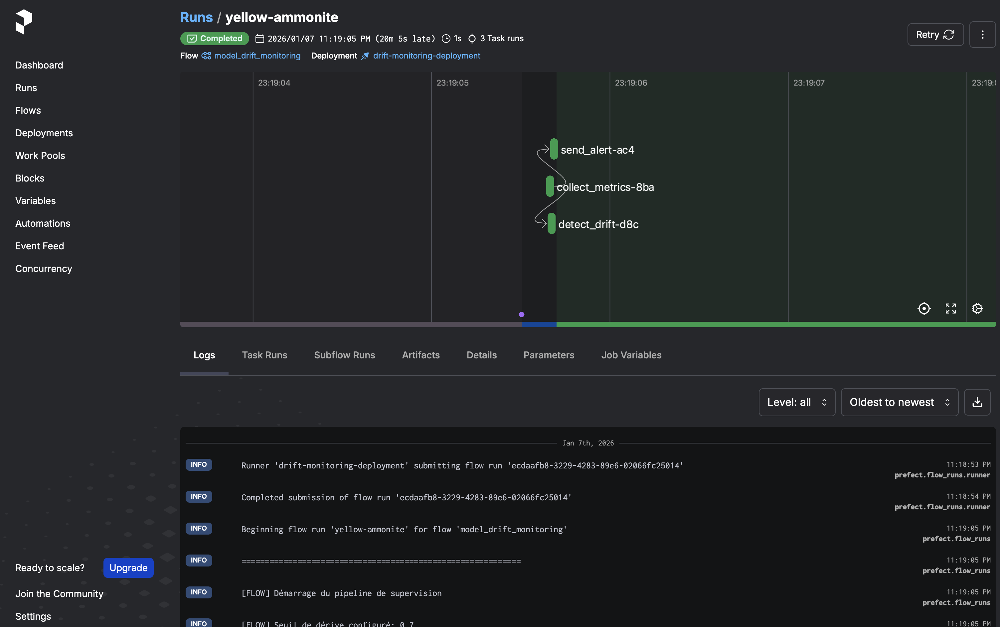
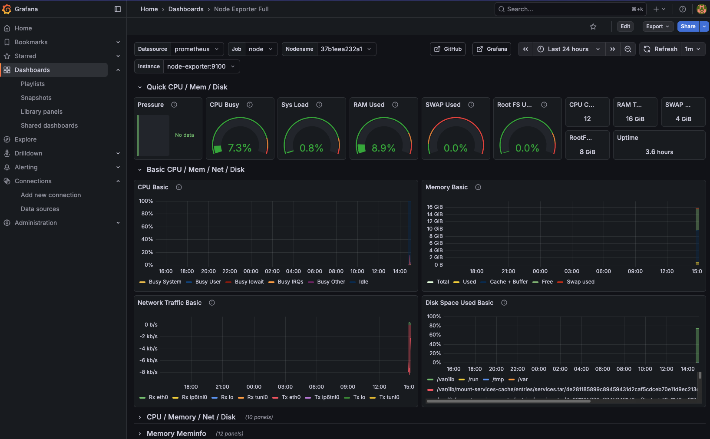
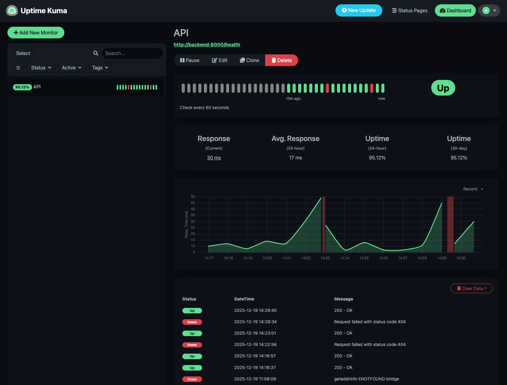
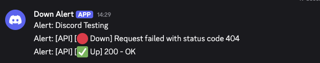

# Module 6 - Brief 1

## Démarrer

### Lancer le projet

La commande suivante permet de lancer tous les composants du projet (backend, frontend, Prefect, Grafana, Uptime Kuma).

```bash
docker compose up
```

## Composants

### Frontend (port 8080)

Interface *Streamlit* permettant d'interagir avec le backend.




### Backend (port 8000)

Une API HTTP exposant les *endpoints* suivants :

- **/predict :** Permet de prédire un chiffre
- **/correct :** Permet de corriger un chiffre
- **/reload :** Permet de recharger le modèle
- **/health :** Permet de connaître le statut de l'API

### Prefect (port 4200)

Prefect est utilisé pour orchestrer les workflows de supervision. L'interface web est accessible sur le port 4200.

Toutes les heures, une procédure de retraining est lancée si nécessaire si plus de 5 corrections ont été ajoutées depuis la dernière procédure.

**Logs :**

Les logs différencient clairement les cas :
- `[OK]` : Pas de dérive détectée
- `[DRIFT]` : Dérive détectée
- `[RETRAINING]` : Réentraînement en cours/terminé
- `[ALERT]` : Notification envoyée



### Grafana (port 3000)

Le Grafana permet de monitorer l'utilisation des ressources par le projet.



### Uptime Kuma (port 3001)

L'interface Uptime Kuma permet de surveiller la disponibilité de l'API et d'envoyer des alerts Discord en cas de panne.





## CI/CD

Les tests unitaires sont évalués à chaque commit sur `main`.

La construction et la publication des images Docker des composants Frontend et Backend sont réalisées à chaque publication de tag.

